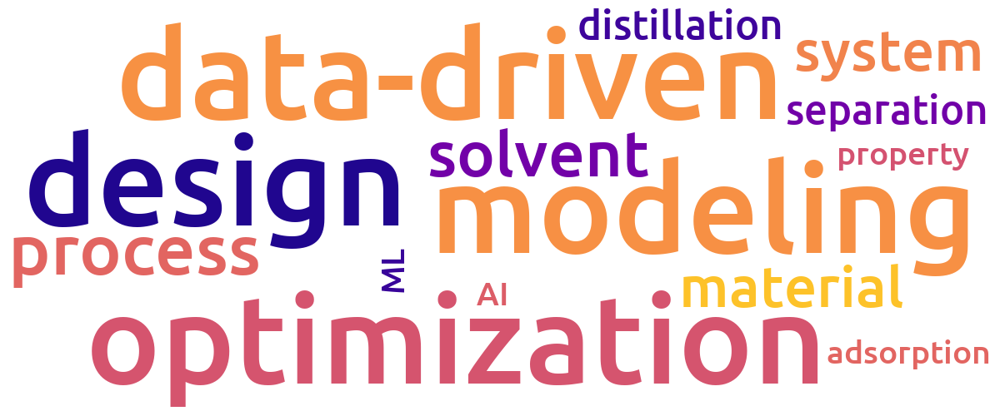

I am currently a Ph.D. student in the **[Process Systems Engineering Group](https://www.mpi-magdeburg.mpg.de/pse)** at the **[Max Planck Institute for Dynamics of Complex Technical Systems](https://www.mpi-magdeburg.mpg.de/2316/en)**, Germany. I received my Bachelor's and Master's degrees both in **Chemical Engineering and Technology** from **Chongqing University**, China.

  

### Main Focus
- Data-driven Multiscale Modeling and Optimization
- Integrated Molecular and Process Design
- Porous Materials for Carbon Capture
- Artificial Intelligence for Science (AI4Science)

 

### Skill
- Mathematical Modeling and Optimization
- Machine Learning
- Computer-Aided Molecular Design
- Process Modeling, Simulation and Optimization
- Molecular Simulation
- Cheminformatics and Materials Informatics
- Web Scraping and Data Mining

